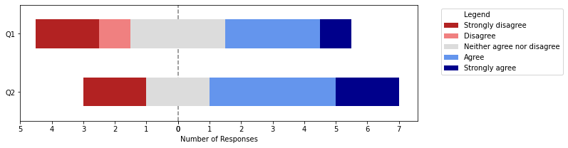

Plot Likert
===========
This is a library to visualize results from [Likert-type](https://en.wikipedia.org/wiki/Likert_scale) survey questions in Python, using [matplotlib](https://matplotlib.org/).




Installation
------------
Install the latest stable version from PyPI:

```shell
pip install plot-likert
```

To get the latest development version:

```shell
pip install --pre plot-likert
# OR
pip install git+https://github.com/nmalkin/plot-likert.git
```


Quick start
-----------
```python
# Make sure you have some data
import pandas as pd

data = pd.DataFrame({'Q1': {0: 'Strongly disagree', 1: 'Agree', ...},
                     'Q2': {0: 'Disagree', 1: 'Strongly agree', ...}})

# Now plot it!
import plot_likert

plot_likert.plot_likert(data, plot_likert.scales.agree, plot_percentage=True);
```


Usage and sample figures
------------------------

To learn about how to use this library and see more example figures,
[visit the User Guide, which is a Jupyter notebook](https://github.com/nmalkin/plot-likert/blob/stable/docs/guide.ipynb).

Want to see even more examples? [Look here](docs/lots_of_random_figures.ipynb)!

Background
----------

This library was inspired by Jason Bryer's great [`likert` package for R](https://cran.r-project.org/web/packages/likert/) (but it's nowhere near as good).
I needed to visualize the results of some Likert-style questions and knew about the `likert` R package but was surprised to find nothing like that existed in Python, except for a [Stackoverflow answer by Austin Cory Bart](https://stackoverflow.com/a/41384812). This package builds on that solution and packages it as a library.

I've since discovered that there may be other solutions out there.
Here are a few to consider:
- https://github.com/dmardanbeigi/Likert_Scale_Plot_in_Python
- https://github.com/Oliph/likertScalePlot
- https://blog.orikami.nl/behind-the-screens-likert-scale-visualization-368557ad72d1

While this library started as a quick-and-dirty hack,
it has been steadily improving thanks to the contributions of a number of community members and [Fjohürs Lykkewe](https://www.youtube.com/watch?v=ef7cTuVUiWs).
Thank you to everyone who has contributed!
